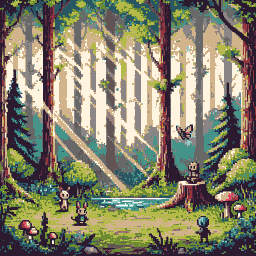

# **Leveraging AI Tools to Create an NFT Collection **

### **Inspiration**
As a person that is good at programming but bad at art, I wanted to see if I would be able to leverage artificial intelligence tools to create a collection of fantasy-themed NFTs that had multiple variations of characters, races, weapons, powers, and more.

Free AI tools that let you generate art were an amazing asset that I wanted to use to create these multiple variations of knights. Using a simple prompt like `"Generate an image of a chibi knight, pixel art style"` yields the following:


Very cool! But there's one problem... the styles are all over the place. It is very difficult to get AI tools to generate images in styles or with variations as consistent as one would need for an NFT collection.

Despite trying with multiple different tool to feed reference images or even generate consistent batches of art, in the end, the AI workflow had to be broken by some manual editing of photos.

I opted instead to generate some images roughly in the style I wanted and then extracted and edited the components that I liked the most. In a perfect world, I would have a base layer knight that could be fed to an AI to modify to have different weapons, armors, etc. My compromise was to generate components and then edit them/extract pieces of them as can be seen below.

Backgrounds:





Headgear:


Expressions:


Armors:


Swords:


We take all of these components and build json files that define the characteristics of a given knight. Then, we take the sprite images those separate components point to and layer them one atop the other using a script. Of course, when assigning characteristics to each knight we account for each attribute's rarity. We can't have every chump rocking a diamond sword, they're called legendary weapons for a reason!

---

## **Resulting Images**


---

## **KnightToken**
After the images are generated and uploaded, the metadata is modified so that each knight's corresponding json file points to the right image. After that, all that's left is to mint as many tokens as we want (spoiler: this is not true) and have each token be associated with a particular knight image and metadata.

The generated NFT collection is visible on this [OpenSea (Testnet) Collection](https://testnets.opensea.io/collection/knight-tkn). Metadata and images are stored on IPFS for decentralized access:
- [Metadata Storage](https://ipfs.io/ipfs/bafybeigs6mglxbhb37oqppb2wc32tyb4jguctuexsii7ho3ynlwcavnhxm/)
- [Image Storage](https://ipfs.io/ipfs/bafybeidx5z4k2cacjpw74b2uxcw4hxt2r4xz5loxc2qgh63sgkaf3kzaie/)

---
## **Notes**

- All the cool races, effects, multiple skin tones, and whatnot were planned but simplified to less features because of time constraints. For now, be satisfied with background, headgear, armor, weapons, eyes, expression, shield.
- In total, there are 5184 variants that can be created. Only 100 were minted though because of storage space limitations but the capability is there.
- The process of generating images went as follows: 
- 1. 
1. Generate metadata (json) files for each knight
- 2. Generate knight image by layering sprites based off metadata (e.g. common shield, rare sword, etc.)
- 3. Store
---
## **Requirements**

- Python 3.6 or higher
- **Pillow** library for image generation:
  ```bash
  pip install pillow
  ```

---

## **Installation**

1. Clone or download this repository:
   ```bash
   git clone https://github.com/your-repo/knight-nft-generator.git
   ```
2. Ensure Python is installed:
   ```bash
   python --version
   ```
3. Install required libraries:
   ```bash
   pip install -r requirements.txt
   ```

---

## **Steps to Generate Knights**

### 1. **Generate Metadata**
Run the `generate_knights.py` script to create metadata for the desired number of knights.

#### **Using Command-Line Arguments**
```bash
python generate_knight_metadata.py 100
```
This will generate metadata for **100 knights** and save each JSON file in the `metadata/` folder.

---

### 2. **Generate Images**
Use the image generation script to create knight images based on their metadata.

Run the script:
```bash
python knight_generation_from_multiple_json.py
```

This will:
- Read metadata JSON files from the `metadata/` folder.
- Generate images for each knight, layering sprites dynamically based on their attributes.
- Save the knight images to the `knights/` folder.

---

### 3. **Update IPFS CID**
Once you upload the knight images to IPFS, you’ll receive a new CID for the image folder. Use the `set_uri_json.py` script to update the `image` field in all JSON metadata files.

#### Command:
```bash
python set_uri_json.py <new_cid>
```

#### Example:
```bash
python set_uri_json.py bafybeiahnlpcj4nralx2iiw3ndtu7txn5dbr6ijpakseclm2haha3nugku
```

This updates the `image` field in each JSON file to:
```plaintext
https://ipfs.io/ipfs/bafybeiahnlpcj4nralx2iiw3ndtu7txn5dbr6ijpakseclm2haha3nugku/knightX.png
```
Where `X` corresponds to each knight’s ID.

---

## **View the Resulting NFT Collection**

The generated Knight NFT collection can be viewed on OpenSea's testnet platform:
- **[Knight Token Collection on OpenSea](https://testnets.opensea.io/collection/knight-tkn)**

---

## **IPFS Storage Links**

- **[Metadata Storage](https://ipfs.io/ipfs/bafybeigs6mglxbhb37oqppb2wc32tyb4jguctuexsii7ho3ynlwcavnhxm/):** Contains metadata JSON files for all knights.
- **[Image Storage](https://ipfs.io/ipfs/bafybeidx5z4k2cacjpw74b2uxcw4hxt2r4xz5loxc2qgh63sgkaf3kzaie/):** Contains knight images (e.g., `knight1.png`, `knight2.png`).

---

## **Output**

### **Metadata JSON File**
Each JSON file contains metadata in the following format:
```json
{
    "name": "Knight #1",
    "description": "Collection of chibi knights with multiple weapons, armor, and more!",
    "image": "https://ipfs.io/ipfs/<cid>/knight1.png",
    "attributes": [
        {"trait_type": "Race", "value": "Human"},
        {"trait_type": "Elemental Aura", "value": "Fire"},
        {"trait_type": "Headgear", "value": "Plain Helmet"},
        {"trait_type": "Weapon", "value": "Simple Sword"},
        {"trait_type": "Shield", "value": "Plain Shield"},
        {"trait_type": "Cloak", "value": "No Cloak"},
        {"trait_type": "Background", "value": "Neutral"},
        {"trait_type": "Expression", "value": "Neutral"},
        {"trait_type": "Eye Color", "value": "Brown"},
        {"trait_type": "Skin Tone", "value": "Light"},
        {"trait_type": "Hair Color", "value": "Black"}
    ]
}
```

### **Generated Images**
Knight images are saved in the `knights/` folder as PNG files:
```plaintext
knight1.png
knight2.png
...
```

---

## **Customization**

- **Traits and Rarities**:
  - Edit the `file_paths` and `rarity_weights` dictionaries in `generate_knights.py` to adjust traits, rarities, or add/remove features.

- ~~**Race-Specific Features**:~~
  ~~- Modify the `race_traits` dictionary to change allowable eye colors, skin tones, and hair colors for each race.~~

---

## **Error Handling**

- **Insufficient Quotas**:
  - If quotas are misconfigured, the script raises an error and terminates.
  - Ensure quotas match the number of knights to generate.

- **File Not Found**:
  - Ensure all sprite files exist in the `sprites/` folder before generating images.

---

## **License**

This project is open-source and free to use.
